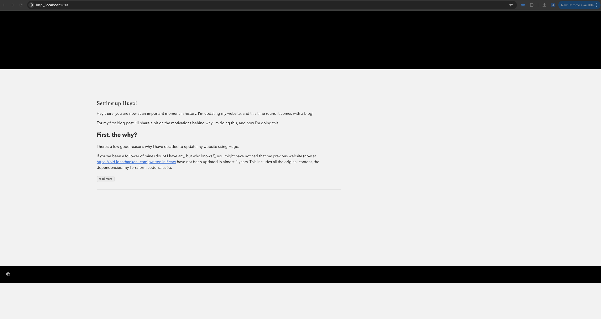

+++
title = "Setting up Hugo!"
description = "How this got up and running"
date = "2025-04-25"
showMetadata = true
+++


Hey there, you are now at an important moment in history. I'm updating my website, and this time round it comes with a blog! 

For my first blog post, I'll share a bit on the motivations behind why I'm doing this, and how I'm doing this.

## First, the why?
There's a few good reasons why I have decided to update my website using Hugo.

If you've been a follower of mine (doubt I have any, but who knows?), you might have noticed that my previous website written in React (check it out if you haven't!) have not been updated in almost 2 years. This includes all the original content, the dependencies, my Terraform code, *et cetra*.

Honestly, the previous website was a real piece of work, granted that I had no prior React experience but decided to whip one up any way. The end result? Kinda not-so-nice and not mobile-friendly website. Some time have passed, I have discovered [Hugo](https://gohugo.io/) by pure chance and was interested in the way how it works.

If you have seen my previous website, it's essentially a VSC clone where I try to created each page as a Markdown file. Now in Hugo, I can do it natively without using libraries such as `react-markdown`!

Although with full honesty, so much time have gone by since I wrote my previous site. It's probably easier for me to just nuke it and rewrite instead of trying to recall what kind of spaghetti I wrote previously.

On the other hand, I've also been quite interested in starting a blog where I share my technology shenanigans, which can also serve as a sort of documentation that's kind of non-existent for all the stuff I've done so far (working on it). These includes setting up Proxmox VE, a Kubernetes cluster powered by TalosOS; but I shall get to those in the future. 

TLDR: I'm updating because I can, but not because I'm looking for new career opportunities.

## Secondly, the how?
With a lot of jungle bashing, and probably a ton of help from Generative AI like Perplexity (not sponsored, I just got a Pro license valid for a year for free!).


Above is an illustration of me trying to make this work.

--

In all seriousness, the making of this site is going to be a good amount of mashing things I already know and figuring things that I do not know yet.

To start off, obviously I had to install `hugo` first. On the Hugo documentation, there are [installation instructions](https://gohugo.io/installation/) for each OS. However, I didn't really want to install Hugo separately and was wondering if there's a more portable alternative.

Of course, when we talk about portable, we talk about containers. *Aaaand* that's how I stumbled across [hugomods](https://hub.docker.com/r/hugomods/hugo) container images. 

Instead of installing Hugo and go -
```bash
hugo new site my-site
```

I now have to go
```bash
# I will explain why the image tag in a short while
docker run --rm -it -v $(pwd):/src hugomods/hugo:std-dart-sass-non-root new site my-site
```

Sounds like a whole lot more work, yeah? Kinda, but not really! Since I'll likely be writing this blog on multiple machines, I figured it might be better to just use images for development. The chances of having `docker` is higher than `hugo` on any machines I use so.. yep.

### Making development easier
We've all been here at some point - over-engineering something thinking it'll make our lives easier. More often than not, it actually doesn't.

In my case, I was thinking *"eh, it's going to be a pain to keep running the commands all day long even with reserve i-search"*, so I decided to write a simple `docker-compose` (I [~~copied~~ referenced it](https://dev.to/robinvanderknaap/setup-hugo-using-docker-43pm)) and `Makefile` with some simple targets to execute some common commands and initialization steps.

I won't go too much into detail on the `compose` file - although a honorary mention is the image tag. Hugomods provides many different types of Docker images, but the Nightfall theme requires `dart-sass`, while I opted for `non-root` (as should everyone else) along with the `std` edition (instead of the extended one, I think). The end result is the "standard edition non-privileged image that comes with dart-sass".  Since this project is still in it's infancy, I'm ok with getting new changes from the images deployed (Hugomod tags specific versions in the tag suffix) for now.

If you have seen my other abandoned (sorry) project, I typically [create](https://github.com/jonzxz/jfc/blob/main/Makefile) `Makefile` for the project to relief myself of having to reverse i-search every time I want to rebuild the project or do something really repetitive.

In this case, I just opted for something really basic first - start, stop, restart on the Docker container, as well as to initialize the set up if I am working on this on another machine.

### Make Aesthetics Great Again
While getting the very basic targets in my `Makefile` up, I got down to writing this post. But something was bothering me.. While the website worked, I wasn't really a big fan of how it looked like -



If we followed Hugo's [Quick Start guide](https://gohugo.io/getting-started/quick-start/), it tells you to install the Ananke theme. By no means it's ugly - it's simple and functional, but I want something more *my style*.

Then, I started looking around to making my own theme. However, while getting started with Hugo is easy, it actually contains a whole lot of other complex configurations that I have *yet* to dive into. To make my journey slightly (*actually much, much*) easier, I've decided to use a pre-made theme called [Nightfall](https://github.com/lordmathis/hugo-theme-nightfall/tree/main).

Configuring the theme wasn't all that difficult, although there are some stuff I have yet to figure out at this point. I am also not a really big fan of `toml` that's used for configurations. After learning that Hugo supports `yaml` and `json`, I mapped everything over to `yaml`. My eyes are now saved. 

## What's Next?
*TBH*, I haven't thought about it that far yet.

So far, I have worked on my [about me](../../about) page along with this blog post. At this moment, this blog isn't published or deployed anywhere yet - so this may not be entirely accurate when the blog is deployed (I'll try to come back and update this post a little bit).

I originally intended to deploy this into S3 as a static site, similar to how I did it for my old site. While looking around at alternatives, [Cloudflare Pages](https://pages.cloudflare.com/) has piqued my interest. Since my current mail forwarding configurations and old site is proxied through Cloudflare, I think it might be worthwhile to explore Pages.

And since I like automating some stuff for no good reason, Cloudflare apparently has a [Terraform provider](https://registry.terraform.io/providers/cloudflare/cloudflare/latest/docs) available as well - so that's probably what I will be getting into.

Not entirely sure when I will have the time to actively work on this again, but promise I will get this deployed ASAP (probably after filling in a bit more details so it functions like my portfolio website).


I should probably keep my first post short, so I'll stop here. Thanks for dropping by and reading this, whoever you are!