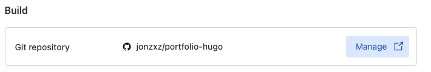
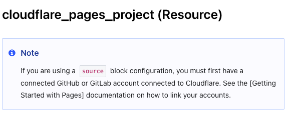

+++
title = "Terraforming with Cloudflare, yay or nay?"
description = "My very brief experience trying out the Cloudflare Terraform Provider."
date = "2025-05-05"
showMetadata = true
+++


Hey there, hopefully it hasn't been too long! In my [last post](../../blogs/001-up-and-running/index), I ended the post with me discovering the Cloudflare Terraform Provider.

Cloudflare have always been a cool company to me - they make most of their stuff free (or at least with a generious free tier). I first started using Cloudflare awhile back when I bought my current domain.

At that point in time when I just finished building my first site, I wanted to enable HTTPS with TLS certificates to my sites. I originally intended to go with Let's Encrypt, but shortly after found out about Cloudflare and their [SSL services](https://developers.cloudflare.com/ssl/).

In short, I ended up moving my domain management from my registrar to Cloudflare, switched my DNS servers to Cloudflare and enabled SSL/TLS. It was so incredibly easy and I really just kinda forgot about it after.

Shortly after, I found out about their [email routing services](https://developers.cloudflare.com/email-routing), which I will talk about in another post (probably). That's how I ended up with `contact@jonathankerk.com` as my email address.

For today though, with all the praises sung for Cloudflare, we're going to talk about my experience trying to "Terraformize" my Cloudflare resources - which includes my DNS records, my email routing configurations and Cloudflare Pages that deploys this site you're looking at right now.

Before I started writing any code, I kinda decided that I'll split the IaC for Cloudflare in 2 different parts - the non-portfolio site (this!) related items will be in a repository, while the site's resources (Pages, DNS records) will be together with the source code of this site (mono-repo.. ftw?).

I'm no stranger to Terraform, but I've almost exclusively only worked on AWS provider and a little bit of GitLab, along with the other common providers like `awscc`, etc.

For AWS and GitLab, we can store states in S3 and GitLab natively. Cue me wanting to keep my Cloudflare IaC as "independent" as possible, I decided to look into compatible backends for Terraform states in Cloudflare. This led me to using a [R2 Bucket](https://developers.cloudflare.com/terraform/advanced-topics/remote-backend/) as a remote backend for Terraform.

## Backend
Since the R2 backend is S3-compatible, the backend block is no stranger to anyone -

```terraform
terraform {
  backend "s3" {
    bucket                      = "terraform-states"
    key                         = "portfolio-hugo/terraform.tfstate"
    region                      = "auto"
    skip_credentials_validation = true
    skip_metadata_api_check     = true
    skip_region_validation      = true
    skip_requesting_account_id  = true
    skip_s3_checksum            = true
    use_path_style              = true
  }
}
```

If you have taken a close look at the documentations, we are missing `access_key`, `secret_key` and `endpoints` for the backend parameters. Since these values are sensitive, we can't really hardcode them into the repository hmm.. 

I ended up with a `sh` script that just does `terraform init` for me with the parameters read from environment variables and initialized -

```sh
terraform init \
    -backend-config="access_key=$R2_ACCESS_KEY" \
    -backend-config="secret_key=$R2_SECRET_KEY" \
    -backend-config="endpoints=$R2_ENDPOINT"
```

## Implementing the email and DNS features
These haven't been too hard as well - in short, I basically created a `dns` and an `email` module.

It's kind of silly if we think about it, because these resources are already there and I'm just writing the code and importing them so that they can be IaC-ed in the future.

### Email
For emails, it's really simple. The configuration I had was that I created a custom email address with my domain name "contact@jonathankerk.com". For any mails that are sent to this, there's basically an email routing rule that forwards all mails to my personal Gmail account.

To achieve this, all we need is the `cloudflare_email_routing_address` and `cloudflare_email_routing_rule` resource blocks.

Cue the extremely simple code -

```terraform
resource "cloudflare_email_routing_address" "this" {
  account_id = var.account_id
  email      = var.actual_email_address
}

# Routing rule entry to actually configure the routing
resource "cloudflare_email_routing_rule" "rule" {
  enabled  = true
  zone_id  = var.zone_id
  name     = "Reroute mails from contact to gmail"
  priority = 0

  matcher {
    type  = "literal"
    field = "to"
    value = var.custom_email_address
  }

  action {
    type  = "forward"
    value = [var.actual_email_address]
  }
}
```

### DNS
Moving on to the DNS, which honestly isn't too complicated either. All we need is `cloudflare_zone` and `cloudflare_record`, where the former basically means a domain zone (which I only own one of), and a map of DNS records to create in the zone.

I have chosen to implement a map of object for my `cloudflare_record` DNS records for better (?) readability -
```terraform
variable "dns_records" {
  type = map(object({
    name           = string
    content        = string
    ttl            = optional(number)
    comment        = optional(string)
    allow_override = optional(bool)
    type           = string
  }))
}
```

Which the truncated version looks like -
```terraform
  dns_records = {
    old = {
      name    = "old"
      content = var.old_static_site_url
      comment = "DNS record to route to old S3 React static site"
      type    = "CNAME"
    },
    primary = {
      name    = var.zone_name
      content = var.cloudflare_pages_project_url
      type    = "CNAME"
    }
  }
```

So that's done and dusted! You can read the source code [here](https://github.com/jonzxz/cloudflare-iac/tree/main), pretty basic code though. Next, on to the Cloudflare Pages stuff (which hosts this site!)

*P.S.* I have also just ran `terraform import` using the CLI. I used `import{}` blocks as well but removed it after since I wanted to keep the codebase simple and clean.

## Pages
Well, this is my first time working on Pages - I set up the backend in a similar fashion, and of course the resources already exist as well; so I'm just importing it.

What I thought would be an easy 5 minute task turned out to be pretty mind-boggling and took me a little bit more time than I really wanted.

To accomplish a Page deployment with IaC, all you really need to create a Cloudflare Page and have it running using Terraform is really just `cloudflare_pages_domain` and `cloudflare_pages_project` (In fact, you don't even need the pages_domain if you do not have a domain). The former is a "Custom domains" option to link your Page to your own domain, while the latter creates the actual project for you.

Before this, the Page was already up with ClickOps with the following Git repository integration -  


This was configured to deploy a new version of the site automatically whenever a new change is pushed to `main`. Pretty neat I think. 

I thought we were on to a good start so I just slamming my keyboard for some Terraform code. I started looking at the [documentations](https://registry.terraform.io/providers/cloudflare/cloudflare/5.3.0/docs/resources/pages_project), which at this point the provider's latest version is `5.3.0`.

Looking through the resource configurations, I started to "reverse engineer" the configurations that I provided during the manual set up. I didn't put too much thought into it and implemented whatever that seemed relevant, *until* I realized that the resource block didn't have any configurations for GitHub integration.

Scrolling to the top of the page, I saw this "Note" -


Okay... so I looked at the `source` blocks available on the page - all of them show up under `Read-Only`.. How do I configure the `source` block if it's read-only? So.. I went looking around and found out someone else is having the same [issue](https://github.com/cloudflare/terraform-provider-cloudflare/issues/5093) as well.

The long story short is, somehow the v5 provider of the Cloudflare provider broke it's `source` block for the `cloudflare_pages_project`, so you can't really create a Pages project with the GitHub integration and stuff.. I've had other issues while setting up as well, such as [data.cloudflare_account taking extremely long to load](https://github.com/cloudflare/terraform-provider-cloudflare/issues/5298)..

Based on the first issue, seems like the bug on the Pages resource isn't present in v4 (is this really a bug though, this is quite a big problem, IMO); so the quickest way to resolution is to downgrade to Cloudflare's v4 provider instead.  

Honestly, other than the two issues I faced, there were other issues as well. At times, the provider wasn't very clear on what is causing the error, so I kind of had to go dig around and figure out, only to find numerous posts on issues with Cloudflare's v5 providers.

## Conclusion
I ended up having to downgrade my Cloudflare providers to `v4` (for both repositories) and everything worked wonders. While Cloudflare's offerings are really a godsent to a lot of people, their Terraform provider (or at least their latest release) just doesn't seem to be production ready.

As much as I appreciate Cloudflare for their services, this is more *Terraflunk* than Terraform, IMO.

I wrote this with the intention of it being a short post to remind myself why I didn't use Cloudflare's v5 provider, and hopefully someone might find this useful if Cloudflare doesn't fix the resource block ever.

On a sidenote, I recently started tinkering (again) with my home-lab which is currently hosting and serving my Home Assistant publicly. Started some work to host a separate `ingress-nginx` controller as well for internal use, stay tuned!