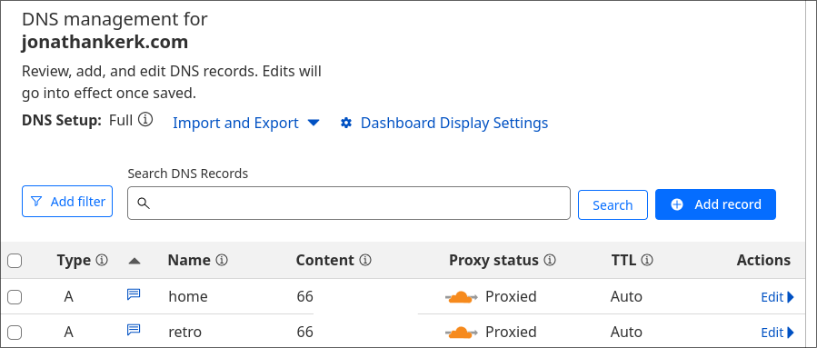
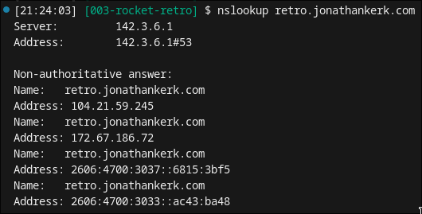
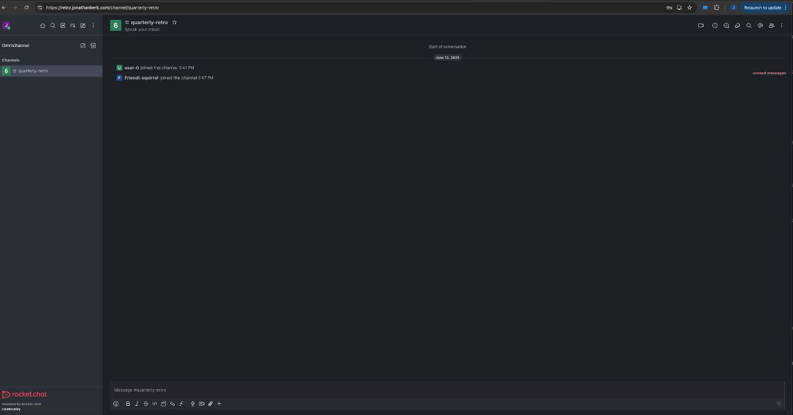
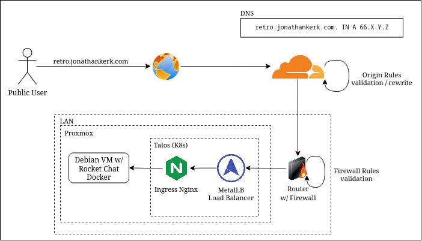

+++
title = "How I hosted an anonymous chat service for my team's retrospective"
description = "Rocket chat, to the moon!"
date = "2025-07-29"
showMetadata = true
+++


Hey there, I know it's been a while - no, I did not give up writing, life's just gotten *kinda* busy.

## Rocket what?

Today, I'll be sharing my brief experience on setting up an anonymous chat service for my team's retrospective session.

To ensure that the team members feel psychologically safe while being able to provide their honest feedback, my fellow team member had a brilliant moment where he suggested: "Why not we have an anonymous chat where people can just fire off their thoughts?". And there it is - we made it happen (It's been about a month-ish since the retro though)!

We had 2 criteria - the service should ideally be: 

1. Self-hosted to prevent the team's conversations from being saved somewhere
1. Be able to serve ~50 people or more

Enter [rocket.chat](https://www.rocket.chat/) (now you know why the image has a rocket)! I chanced upon Rocket.chat while surfing on Reddit for some options, and Rocket.chat seemed to fit the bill. I won't go into the details of the product, but I used the [Community Edition](https://docs.rocket.chat/v1/docs/our-plans#community) that I can self-host.

## Setting up the service

But.. where? Enter my trusty home server running Proxmox (which I've been wanting to write a blog post on, but just couldn't find the time to). My trusty Proxmox virtual environment now currently runs a Kubernetes cluster based on TalosOS (yep, virtual nodes), so the initial idea was to [deploy Rocket Chat on Kubernetes](https://docs.rocket.chat/docs/configuring-rocketchat-with-kubernetes). However, since I had very little time to get things up and running, I employed my cheat-code: `docker-compose`.

I went through the [documentation](https://docs.rocket.chat/docs/deploy-with-docker-docker-compose) on deploying Rocket Chat with Compose, and quickly set up a Debian based VM in my Proxmox.

Setting up Rocket.chat was pretty straightforward - we'll [download the compose file](https://docs.rocket.chat/docs/deploy-with-docker-docker-compose#step-2-fetch-the-compose-file) from Rocket Chat, and honestly t hat's all you kind of need. I honestly left all the values default - the compose file handles creation of the MongoDB that's required by the Rocket Chat instance, so all I did was really `docker compose up -d`.

Since the VM was created using `vmbr0` (bridge mode) which meant it had a private IP in my LAN, I went ahead and set it as a static IP reservation. 

That's all for the boring part - now that I have the Rocket Chat instance up (unforunately I do not have any pictures :sad:) in my LAN, how do I get my colleagues to access my service?

## Reaching the service (from LAN)

Well - remember I have a [TalosOS](https://www.talos.dev/) Kubernetes cluster running in the home lab? Previously, I tinkered with it and installed [ingress-nginx](https://github.com/kubernetes/ingress-nginx) within the cluster.

So far, the only purpose of the Ingress controller was to redirect traffic to my Home Assistant (hosted at `home.jonathankerk.com`) from the public Internet. Logically, it worked the same way - so I configured traffic destined for `retro.jonathankerk.com` (defunct now) to route to the VM (and the Docker container).

I also have an existing [MetalLB](https://metallb.io/) installation in the cluster with `IPAddressPool` and `L2Advertisement` CRDs to complete the package, but that's for another day!

The idea is pretty simple - with the Ingress Controller in place, all I had to do was to create an Ingress that points to a Service of `ExternalName`:

```
apiVersion: v1
kind: Service
metadata:
  name: rocket-redirect
  namespace: rocket-redirect
spec:
  type: ExternalName
  externalName: <DNS name of VM in LAN>
  ports:
  - name: http
    port: 80
    protocol: TCP
    targetPort: 3000
---

apiVersion: networking.k8s.io/v1
kind: Ingress
metadata:
  name: rocket-redirect
  namespace: rocket-redirect
spec:
  ingressClassName: nginx
  rules:
  - host: retro.jonathankerk.com
    http:
      paths:
      - pathType: Prefix
        path: /
        backend:
          service:
            name: rocket-redirect
            port:
              number: 80
```

## Reaching the service, from the world!

Now that we've got the setup in the local network settled, we'll have to somehow resolve `retro.jonathankerk.com` from the public Internet to my VM sitting comfortably in my home lab.

Currently, my public domain `jonathankerk.com` uses Cloudflare for DNS, which you can take a look at how I configured my [Cloudflare stuff with Terraform](../002-cloudflare-iac/index.md). The long story short is to add a record for `retro.jonathankerk.com` pointing to my public static IP address by my ISP.

Referencing my [cloudflare-iac module](https://github.com/jonzxz/cloudflare-iac/blob/main/main.tf), it's as easy as adding the following element in the `dns_records` map -

```tf
dns_records = {
  ...
  retro = {
    name    = "retro"
    content = var.public_ip
    type    = "A"
    comment = "Rocket chat"
  }
}
```

The outcome (I masked my public IP, although there's really not much reason to):




Now that we have the DNS record for `retro.jonathankerk.com` resolvable:



We'll just want to make sure that requests to `retro.jonathankerk.com` that are being proxied through Cloudflare actually gets sent to the correct destination port on my public address. This is possible by the use of [Origin Rules](https://developers.cloudflare.com/rules/origin-rules/), where I have an extremely naive rule setup:

```
(http.host in {"home.jonathankerk.com" "retro.jonathankerk.com"} and ip.src.country eq "SG")
```

When the HTTP requests are Singapore based and matches either sub-domains of mine, it gets redirected to a designated destination port in my home network.

Of course, there are also firewall rules set up in my home router that only allows IP addresses from [Cloudflare's public IPs](https://www.cloudflare.com/ips/) entering my home network. I'd love to expand on that but I think that's somewhat scope-creeping a little bit too much..

## Finally, some pic (no s!)
I unfortunately did not get much screenshots of what was actually done, so all I've got was a screenshot from one of the testing when I finally got the chat accessible from the public net:



All in all, it was a pretty good experience setting this up. For a temporary service that I needed for a retrospective session with the team this worked well enough. I exported the chat session and tore down the VM afterwards and really only got to write this post much later, please pardon the lack of images; but I hope you take something away from this post. 

To end things off, I think it'll be easier to explain with a simple visual for anyone that may require a similar set up. Sorry for the terrible diagram, promise I usually draw *slightly* better -



I really want to write a post on how I got my homelab (Proxmox, Talos and all that shizzle) up and running, but I'll leave that for next time!

